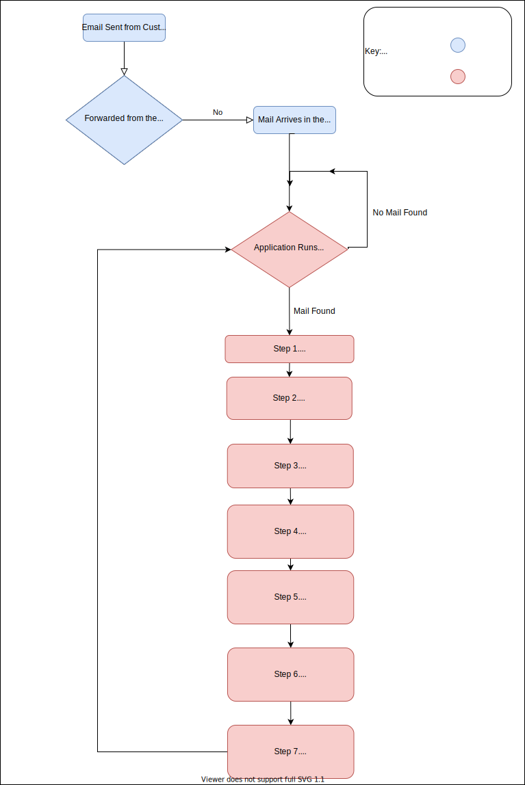

# EmailReports
This is a server that will check a gmail account for a specific type of email and then download attachments clean up the data into a nice report and email this back to the person who sent it.

Instructions when setting up a new customer:

1) Create an email account for them
    a) This menas going to hover or another provider and create a custom email address that the customer will email their attachments to. (e.g. cisco@rapidreports.org for a cisco customer) <--- This costs $19/yr
    b) Set up forwarding to a gmail account/use the same one to forward it too and use a tag to ensure that customer's emails don't end up in the same place.
2) Pull down the latest release of the repo.
3) Create the custom report using golang that will run on the attachments
4) Get testing done and signed off by the customer 
5) Make the docker file and deploy it.